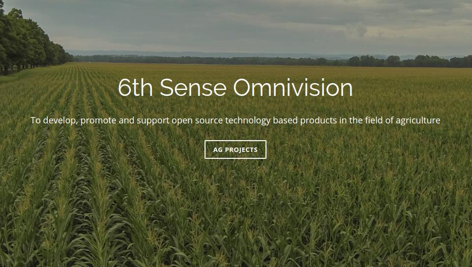

# ROS_Based_Farm_Robot

the official site of this project is [6OMVI](9omvi.org)

## This repository aims at creating a ROS based farm bot that gets input from an unmaned aerial vehicle (UAV).

presently we are working on - 

1) ### image mosaicing 
- presently we are using opencv_contrib
- this is done in 3 parts
	- homography
	- warping
	- blending

2) ### orthogonal rectification of images
- using webODM for image rectification

- one of the two methods that can be used are:
	- ground control points (GCP) which are determined from published maps or global positioning systems (GPS).
	- digital elevation model (DEM) which are 3d representation of a terrain.

### better way for rectification and stitching
We are using the SIFT (Scale Invariant Feature Transform) and SURF (Speeded-Up Ro-bust Features) algorithms to simultaneously ortho-rectify the images and also stitch them.
